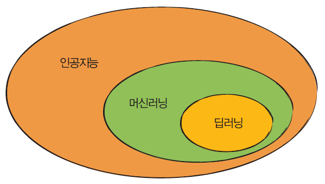
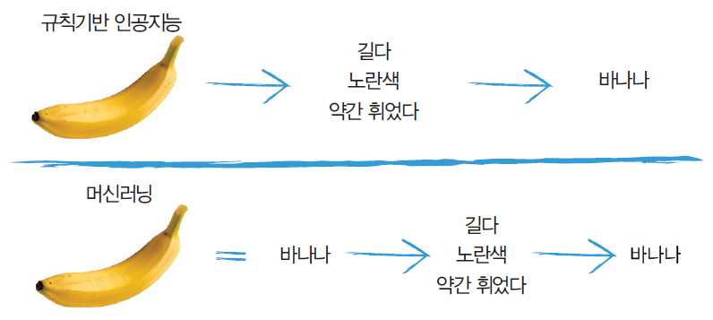
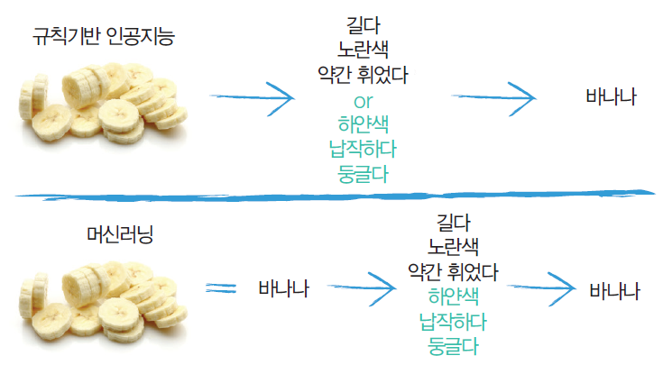
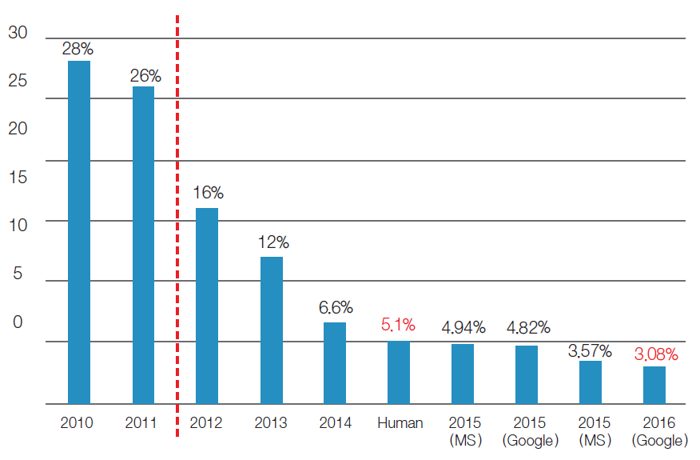
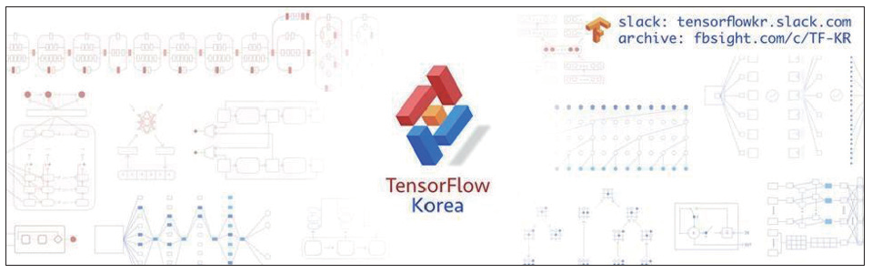
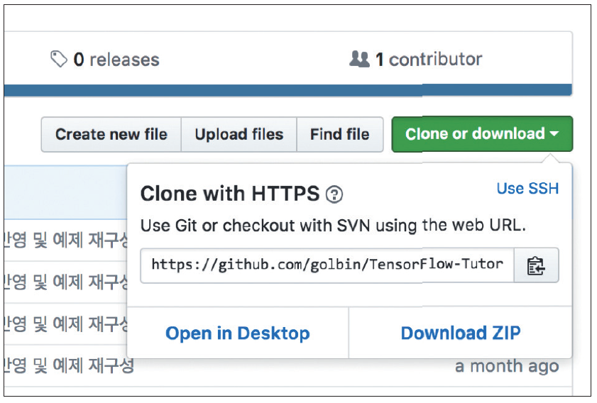
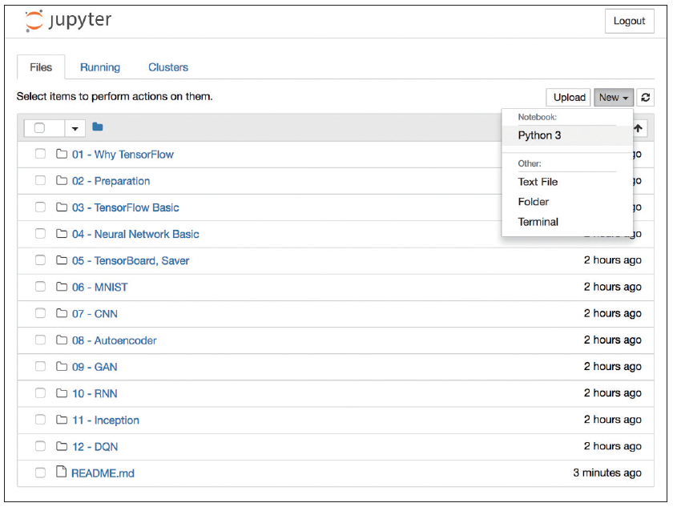
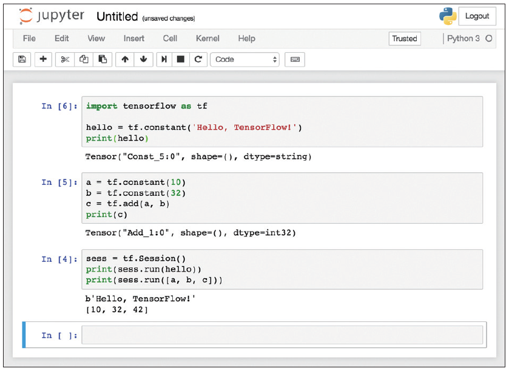

## 1장 딥러닝과 텐서플로의 만남

### 1.1 인공지능, 머신러닝 그리고 딥러닝
2016년 알파고의 등장 이후 갑자기 일반에 **인공지능**(_artificial intelligence_)이라는 단어가 급격히 회자되기 시작했습니다. 그리고 이 책의 주제인 딥러닝, 즉 인공신경망 역시 굉장한 기세로 인터넷을 뒤덮기 시작했습니다. 인공신경망이 바로 알파고의 핵심 기술이기 때문이죠. 그럼 인공지능과 인공신경망은 어떻게 다른 것일까요?

인공지능에 대한 명확한 정의는 아직 없지만, 저는 인공지능은 관념에 가까운 것으로, 컴퓨터가 인간의 사고를 모방하는 모든 것을 뜻한다고 보고 있습니다. 그리고 **머신러닝**(_machine learning_)은 개념으로써, 컴퓨터가 스스로 학습하는 것을 말합니다. 특히 주어진 데이터를 이용해서 말이죠. 그리고 요즘 **딥러닝**(_deep learning_)으로 대표되는 **인공신경망**(_artificial neural network_)은 머신러닝을 구현하는 기술의 하나로, 인간 뇌의 동작 방식에서 착안하여 개발한 학습 방법입니다.

**그림 1-1** 인공지능 > 머신러닝 > 딥러닝



간단하게 예를 들어보겠습니다. [그림 1-2]의 위쪽처럼 기존의 인공지능인 **규칙기반 인공지능**(_rule-based AI_)이 바나나를 인식하도록 하려면 인간이 컴퓨터에 바나나를 식별하는 **특징**(_feature_)을 가르쳐줘야 했습니다. “길고, 노란색이고, 약간 휜 물체면 바나나야”라는 식이죠.

하지만 머신러닝의 학습 방식은 [그림 1-2]의 아래쪽과 같습니다. 바나나 사진을 주고 “이것이 바나나야”라고 하면 컴퓨터가 스스로 바나나의 특징을 학습합니다. “음. 바나나는 길고, 노란색이고, 휜 것이군”이라고 말이죠.

> **NOTE:** 머신러닝에는 다양한 방법이 있지만, 간략히 설명하기 위해 약간 비약하였습니다. 참고로 이러한 방법을 end-to-end 학습이라고 하며, 딥러닝이 바로 이러한 방식으로 학습합니다.

**그림 1-2** 규칙기반 인공지능과 머신러닝의 바나나 인식


그러면 인공지능에 썰어놓은 바나나를 추가로 인식시키려면 어떻게 해야 할까요? 규칙기반 인공지능은 앞의 규칙에 “하얀색이고, 납작하고, 둥글다”라는 특징을 수작업으로 추가해줘야 합니다. 하지만 머신러닝은 썰어놓은 바나나 사진만 입력해주면 알아서 새로운 특징을 학습하고 인식할 수 있습니다.

**그림 1-3** 썰어놓은 바나나를 인식하는 방법


즉, 풀고자 하는 문제가 복잡할수록 규칙기반 인공지능보다는 머신러닝을 이용한 인공지능이 문제를 훨씬 더 효율적으로 해결할 수 있으리라 예상할 수 있습니다. 인간이 모든 특징을 분석하고 알고리즘을 만들어서 입력하는 것보다, 컴퓨터가 직접 특징을 추출하는 쪽이 더 빠르고 정확하다면 말이죠.

그러나 머신러닝 역시 한계가 있었습니다. 인간도 파악하기 어려울 정도로 복잡한 문제는 머신러닝으로도 풀기가 어려웠습니다. 하지만 2012년의 ILSVRC라는 이미지 인식 대회에서 큰 사건이 일어나면서 판세가 급격히 바뀌기 시작했습니다.

ILSVRC는 **이미지넷**(_ImageNet_)이 제공하는 1,000여 카테고리로 분류된 100만 개의 이미지를 인식하여 그 정확도를 겨루는 대회입니다. 이 대회에서 2011년까지는 이미지 인식률이 75%를 넘지 못하였는데, 2012년 대회에서 인공신경망을 이용한 알렉스넷(_AlexNet_)이 무려 84.7%라는 놀라운 인식률을 달성합니다. 그 이후부터는 딥러닝을 이용한 인공지능이 상위 랭크를 모두 휩쓸었고, 매년 인식률이 높아져, 현재는 상당수의 도전자가 97%에 육박하는 인식률을 기록하고 있습니다. 이는 인간의 인식률인 95%를 훨씬 웃도는 수준입니다.

**그림 1-4** ILSVRC 인식 오류율(100% - 인식률)


여기서 잠시, 사실 인공신경망은 이미 1940년대부터 연구되던 기술입니다. 그런데 이렇게 좋은 기술이 왜 지금에서야 부상하게 된 것일까요? 그것은 바로 빅데이터와 GPU의 발전, 그리고 다양한 딥러닝 알고리즘의 발명 덕분입니다.

앞서 말씀드렸듯이 머신러닝은 기본적으로 데이터에서 컴퓨터가 직접 특징을 추출하는 방식이기 때문에 데이터가 많으면 많을수록 더 좋은 특징들을 많이 발견하여 정확도를 높일 수 있습니다. 인터넷이 생겨나기 전에는 데이터를 수급하기가 어려웠지만, 인터넷이 폭발적으로 성장하면서 어마어마한 양의 데이터를 쉽게 수급할 수 있게 되어 데이터 문제가 해결되기 시작했습니다.

그리고 인공신경망은 수백만에서 수조 개로 이뤄진 아주 간단한 수식 계산을 수천 번 이상 해야 합니다. 예전에는 불가능하다고 여길 정도의 계산량이었으나, GPU의 병렬처리 능력을 활용하고 역전파 등의 알고리즘을 통해 계산량을 많이 줄일 수 있게 되면서 이 문제 역시 해결되기 시작했습니다. 지금은 일반 데스크톱으로도 간단한 이미지를 인식시키는 신경망은 어렵지 않게 학습시킬 수 있을 정도니까요(4장에서 더 자세하게 설명하겠습니다).

더불어, 수많은 연구자와 회사들이 다양한 온라인 교육 프로그램과 오픈 소스들을 대중에 공개하였고, 이를 통해 많은 사람이 연구에 참여하게 된 것도 딥러닝이 급속도로 발전하게 된 계기가 되었습니다.

물론 인공신경망으로 모든 것을 해결할 수는 없습니다. 딥러닝에는 일반적으로 매우 많은 데이터가 필요하기 때문이죠. 따라서 데이터가 적다면 딥러닝이 아닌 다른 머신러닝 알고리즘을 사용하는 것이 좋을 수 있습니다.

어쨌든 딥러닝 덕분에 인공지능과 머신러닝의 시대가 다시 열렸다는 사실은 부인할 수 없을 것입니다.

### 1.2 왜 텐서플로인가?
**텐서플로**(_TensorFlow_)는 머신러닝 프로그램, 특히 딥러닝 프로그램을 쉽게 구현할 수 있도록 다양한 기능을 제공해주는 머신러닝 라이브러리로, 모두가 잘 아는 구글에서 만들었습니다.

텐서플로 자체는 기본적으로 C++로 작성했지만 파이썬, 자바, 고(_Go_) 등 다양한 언어를 지원합니다. 다만, 파이썬을 최우선으로 지원하여 대다수 편의 기능이 파이썬 라이브러리로만 구현되어 있으니 되도록이면 파이썬으로 개발하는 것이 가장 편리합니다.

또한 윈도우, 맥, 리눅스뿐만 아니라 안드로이드, iOS, 라즈베리 파이 등 다양한 시스템에서 쉽게 사용할 수 있도록 지원하여 매우 다양한 곳에 응용할 수 있습니다.

물론 머신러닝/딥러닝을 위한 라이브러리로 텐서플로가 유일한 것은 아닙니다. 토치(_Torch_), 카페(_Caffe_), MXNet, 체이너(_Chainer_), CNTK 등 많은 라이브러리가 있습니다. 그렇다면 왜 텐서플로를 사용하는 것일까요? 제가 생각하는 답은 커뮤니티입니다. 특히 저 같은 엔지니어에게 있어서 라이브러리를 선택할 때 가장 중요한 기준은 커뮤니티라고 생각합니다. 실무에 적용했을 때 생기는 문제점들을 해결하거나, 라이브러리 자체에 버그가 있을 때 얼마나 빠르게 수정되는가 하는 그런 것들. 바로 그런 요인들이 실무를 하는 엔지니어에게는 가장 중요한 부분이라고 할 수 있을 것입니다.

그런 점에 있어 현존하는 머신러닝 라이브러리 중 커뮤니티가 가장 북적이는 것이 바로 텐서플로입니다. 깃허브의 텐서플로 저장소나 각종 애플리케이션, 클라우드 서비스 등은 물론, 새로운 논문이 나올 때마다 텐서플로로 된 구현체가 가장 먼저 나올 정도로 텐서플로 커뮤니티는 놀라울 만큼 활발하게 움직이고 있습니다.

**그림 1-5** TensorFlow KR 페이스북 (2017년 8월 24일 현재 가입자 21,975명)


당연하게도 구글 역시 텐서플로 커뮤니티를 상당히 적극적으로 지원하며, 한국에서는 페이스북의 TensorFlow KR 커뮤니티가 매우 활발하게 활동하고 있습니다. 그러므로 한국에 계신 연구자분들, 특히 머신러닝과 딥러닝을 처음 접하는 엔지니어라면 텐서플로로 시작하는 것이 딥러닝을 더 수월하게 익히는 길이라고 생각합니다.


## 2장 텐서플로 설치와 주피터 노트북

이 책은 파이썬 또는 기타 프로그래밍 언어를 어느 정도 아는 분을 대상으로 썼습니다. 따라서 설치 방법을 자세하게 설명하기보다는 어떠한 설치 방법들이 있는지, 그리고 이 책의 예제를 실행하는 데 필요한 라이브러리 설치를 중심으로 설명하겠습니다.

### 2.1 파이썬 및 필수 라이브러리 설치하기
이 책의 예제는 파이썬 3.6 버전과 텐서플로 1.2 버전을 기준으로 썼습니다. 따라서 파이썬 3.6을 설치해야 합니다(윈도우에서는 반드시 파이썬 3.5 이상, 64비트용을 사용해야 합니다).

맥, 리눅스, 윈도우 사용자 모두 다음 주소에서 파이썬을 내려받아 설치할 수 있습니다.

* https://www.python.org/downloads/

파이썬을 잘 설치했다면 텐서플로 설치는 매우 쉽습니다. 다음처럼 맥과 리눅스의 터미널 또는 윈도우의 명령 프롬프트에서 pip3 명령어를 사용하면 됩니다.

```
C:\> pip3 install --upgrade tensorflow
```

만약 엔비디아 GPU를 사용하고 있다면, 엔비디아 사이트에서 CUDA 툴킷을 설치한 뒤 다음의 명령어로 쉽게 GPU 가속을 지원하는 텐서플로를 설치할 수 있습니다(CUDA 툴킷 문서 http://docs.nvidia.com/cuda 참조).

```
C:\> pip3 install --upgrade tensorflow-gpu
```

그런 다음 이 책에서 사용하는 라이브러리들을 설치합니다.

```
C:\> pip3 install numpy matplotlib pillow
```

* numpy - 수치 계산 라이브러리
* matplotlib - 그래프 출력 라이브러리
* pillow - 이미지 처리 라이브러리

이 외에 홈브루Homebrew, 아나콘다Anaconda 또는 소스를 직접 빌드해서 설치하는 다양한 방법이 있습니다. 설치가 잘 안 되거나 더 다양한 방법들을 알고 싶다면 다음의 텐서플로의 공식 홈페이지에서 확인하세요.

* https://www.tensorflow.org/install

### 2.2 텐서플로 예제 내려받고 실행해보기
이 책의 모든 예제는 깃허브 저장소 https://github.com/golbin/TensorFlow-Tutorials에 올려뒀습니다. 다음의 git 명령어로 소스코드 전체를 내려받거나, 압축 파일을 내려받아 적당한 위치에 풀어둡니다.

```
C:\> git clone https://github.com/golbin/TensorFlow-Tutorials.git
```

**그림 2-1** 깃허브에서 예제 소스 압축 파일 내려받기


그런 다음 터미널이나 명령 프롬프트에서 TensorFlow-Tutorials / 03 - TensorFlow Basic 위치로 이동한 뒤 다음 명령어를 실행해 파이썬과 텐서플로가 잘 설치되었는지 확인해봅니다. 

```
C:\TensorFlow-Tutorials\03 - TensorFlow Basic> python3 "01 - Basic.py"
Tensor("Const:0", shape=(), dtype=string)
Tensor("Add:0", shape=(), dtype=int32)
b'Hello, TensorFlow!'
[10, 32, 42]
```

윈도우에서는 탐색기를 이용해 원하는 폴더로 이동한 뒤 Shift + 마우스 오른쪽 버튼을 누르면, ‘여기서 PowerShell 창 열기’라는 메뉴를 통해 쉽게 해당 폴더를 명령 프롬프트로 열 수 있습니다(구버전 윈도우에서는 ‘여기서 명령 창 열기’). 또한, 터미널이나 명령 프롬프트에서 파일명의 일부를 입력한 뒤 TAB 키를 누르면 파일 이름이 자동완성되니 참고해주세요.

> **NOTE:** 텐서플로 실행 시 다음과 같은 경고 메시지가 나올 수 있지만 텐서플로 실행에는 문제없으니 무시하셔도 됩니다.
>
>```
>2017-06-30 19:15:49.653301: W tensorflow/core/platform/cpu_feature_guard.cc:45] The TensorFlow library wasn't compiled to use SSE4.2 instructions, but these are available on your machine and could speed up CPU computations.
>2017-06-30 19:15:49.653322: W tensorflow/core/platform/cpu_feature_guard.cc:45] The TensorFlow library wasn't compiled to use AVX instructions, but these are available on your machine and could speed up CPU computations.
>```

이 메시지가 보기 싫다면 터미널에서 다음 명령어를 실행해 경고 메시지를 없앨 수 있습니다.

```
export TF_CPP_MIN_LOG_LEVEL=2 // 리눅스, 맥
set TF_CPP_MIN_LOG_LEVEL=2 // 윈도우
```

## 2.3 주피터 노트북
주피터 노트북Jupyter Notebook은 웹브라우저상에서 파이썬 코드를 단계적으로 쉽게 실행하고, 시각적으로 빠르게 확인해볼 수 있도록 해주는 프로그램입니다(다른 프로그래밍 언어도 지원합니다).

주피터 노트북의 설치와 사용법은 매우 간단합니다. 먼저 설치는 일반적인 파이썬 패키지와 같이 pip3를 이용하면 됩니다.

```
C:\> pip3 install jupyter
```

그런 다음 프로젝트를 진행할 폴더의 터미널 또는 명령 프롬프트에서 다음 명령을 실행합니다.

```
C:\> jupyter notebook
```

그러면 웹브라우저가 열리면서 주피터 노트북이 실행될 것입니다.

**그림 2-2** 주피터 노트북을 TensorFlow-Tutorials 저장소의 폴더에서 실행한 모습


주피터 노트북을 실행한 다음 오른쪽의 [New] -> [Python 3] 메뉴를 눌러 새 프로젝트를 만들 수 있습니다.

새 프로젝트가 생성된 뒤, 파이썬 코드들을 넣고 Shift + Enter를 치면 다음처럼 코드 조각들의 실행 결과를 쉽게 확인할 수 있습니다.

**그림 2-3** 주피터 노트북 사용 예


이처럼 주피터 노트북은 파이썬 코드를 반복해서 실행하고 중간중간 결과를 확인하기에 매우 좋은 프로그램입니다. 하지만 이 책은 기본적으로 명령 프롬프트에서 실행하는 것을 가정하므로 주피터 노트북에서는 실행되지 않는 경우도 있을 것입니다(그래프를 그리거나 실행이 오래 걸리는 경우 등). 이런 경우가 생기면 당황하지 말고 구글링을 하시면 쉽게 해결책을 찾을 수 있을 것입니다. 구글은 모든 엔지니어의 친구니까요.

